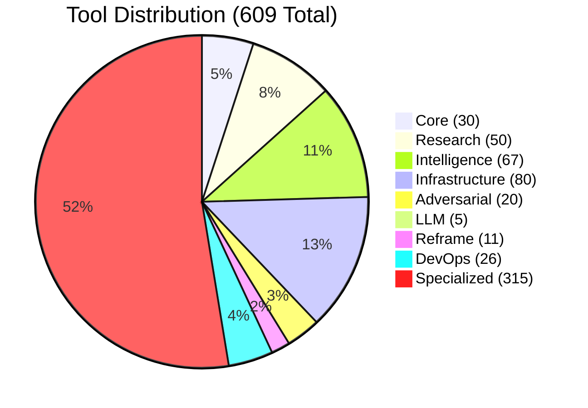
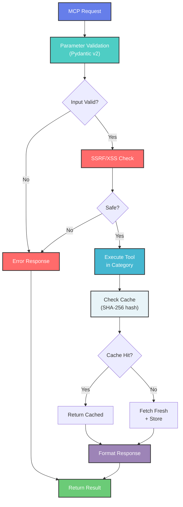
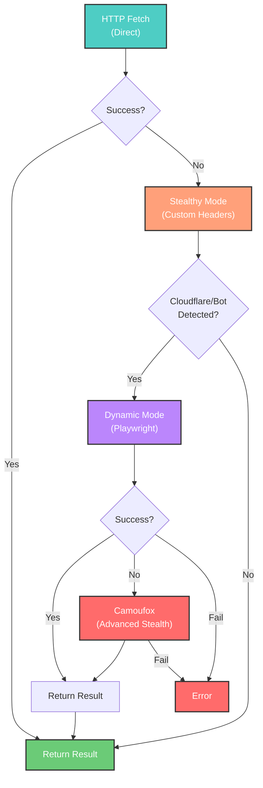

# Loom Architecture Flowchart

Visual architecture of the 609-tool Loom platform.

## System Architecture Diagram

```mermaid
graph TB
    Client["🖥️ Client Layer"]
    TypierCLI["Typer CLI<br/>(loom command)"]
    MCPClients["MCP Clients<br/>(Python, JavaScript, etc.)"]
    
    Gateway["🌐 Gateway & Routing<br/>:8787 - StreamableHTTP"]
    
    Core["⚙️ Core Services<br/>30 tools<br/>• Cache management<br/>• Search & fetch<br/>• Tool discovery"]
    
    Research["📚 Research Pipeline<br/>50 tools<br/>• Deep analysis<br/>• Markdown extraction<br/>• URL analysis"]
    
    Intelligence["🔍 Intelligence Tools<br/>67 tools<br/>• Threat intel<br/>• OSINT<br/>• Profile analysis"]
    
    Infrastructure["🏗️ Infrastructure<br/>80 tools<br/>• VastAI<br/>• Billing<br/>• Tor/Darkweb<br/>• Storage"]
    
    Adversarial["⚔️ Adversarial<br/>20 tools<br/>• Attack orchestration<br/>• Constraint optimization<br/>• Evidence pipeline"]
    
    LLM["🤖 LLM Services<br/>5 tools<br/>• Multi-model integration<br/>• Summarization<br/>• Classification"]
    
    Reframe["🎯 Prompt Reframing<br/>11 tools<br/>• Strategy selection<br/>• Optimization<br/>• Analysis"]
    
    DevOps["⚡ DevOps<br/>26 tools<br/>• CI/CD<br/>• Monitoring<br/>• Deployment"]
    
    Specialized["🔧 Specialized<br/>315 tools<br/>• Academic integrity<br/>• Privacy/Anonymity<br/>• Career intelligence<br/>• Creative research<br/>• Security analysis<br/>• Media processing"]
    
    Config["📋 Configuration<br/>ConfigModel<br/>Pydantic v2"]
    
    Cache["💾 Cache System<br/>SHA-256 content hash<br/>Daily directories<br/>Atomic writes"]
    
    Sessions["🔐 Session Manager<br/>In-memory registry<br/>SQLite persistence<br/>LRU eviction"]
    
    Providers["🔗 External Providers<br/>8 LLM providers<br/>21+ search engines<br/>Scraping engines"]
    
    Client --> TypierCLI
    Client --> MCPClients
    
    TypierCLI --> Gateway
    MCPClients --> Gateway
    
    Gateway --> Core
    Gateway --> Research
    Gateway --> Intelligence
    Gateway --> Infrastructure
    Gateway --> Adversarial
    Gateway --> LLM
    Gateway --> Reframe
    Gateway --> DevOps
    Gateway --> Specialized
    
    Core --> Cache
    Research --> Cache
    Intelligence --> Cache
    
    Core --> Config
    Research --> Config
    Infrastructure --> Config
    
    Core --> Sessions
    Research --> Sessions
    Infrastructure --> Sessions
    
    Research --> Providers
    Intelligence --> Providers
    Infrastructure --> Providers
    LLM --> Providers
    
    style Client fill:#667eea,stroke:#333,stroke-width:2px,color:#fff
    style TypierCLI fill:#667eea,stroke:#333,stroke-width:2px,color:#fff
    style MCPClients fill:#667eea,stroke:#333,stroke-width:2px,color:#fff
    style Gateway fill:#764ba2,stroke:#333,stroke-width:3px,color:#fff
    style Core fill:#FF6B6B,stroke:#333,stroke-width:2px,color:#fff
    style Research fill:#4ECDC4,stroke:#333,stroke-width:2px,color:#fff
    style Intelligence fill:#45B7D1,stroke:#333,stroke-width:2px,color:#fff
    style Infrastructure fill:#FFA07A,stroke:#333,stroke-width:2px,color:#fff
    style Adversarial fill:#DDA15E,stroke:#333,stroke-width:2px,color:#000
    style LLM fill:#6BCB77,stroke:#333,stroke-width:2px,color:#fff
    style Reframe fill:#9D84B7,stroke:#333,stroke-width:2px,color:#fff
    style DevOps fill:#F7DC6F,stroke:#333,stroke-width:2px,color:#000
    style Specialized fill:#BB86FC,stroke:#333,stroke-width:2px,color:#fff
    style Config fill:#E8F4F8,stroke:#333,stroke-width:2px,color:#333
    style Cache fill:#E8F4F8,stroke:#333,stroke-width:2px,color:#333
    style Sessions fill:#E8F4F8,stroke:#333,stroke-width:2px,color:#333
    style Providers fill:#E8F4F8,stroke:#333,stroke-width:2px,color:#333
```



## Data Flow Pipeline

```mermaid
graph LR
    Query["User Query"]
    Detect["Type Detection<br/>(Academic/Code/Knowledge/General)"]
    ProviderSelect["Provider Selection<br/>(8 LLM + 21 Search)"]
    Search["Initial Search"]
    Filter["Result Filtering<br/>& Dedup"]
    Validate["URL Validation<br/>(SSRF check)"]
    Fetch["Fetch with Escalation<br/>HTTP → Stealthy → Dynamic"]
    Extract["Extract to Markdown<br/>(Crawl4AI + Trafilatura)"]
    Dedup["Content Dedup"]
    StructExtract["Structured Extraction<br/>(LLM-powered)"]
    Citation["Citation Parsing"]
    Sentiment["Community Sentiment<br/>(HN + Reddit)"]
    Ranking["Final Ranking<br/>& Output"]
    
    Query --> Detect
    Detect --> ProviderSelect
    ProviderSelect --> Search
    Search --> Filter
    Filter --> Validate
    Validate --> Fetch
    Fetch --> Extract
    Extract --> Dedup
    Dedup --> StructExtract
    StructExtract --> Citation
    Citation --> Sentiment
    Sentiment --> Ranking
    
    style Query fill:#667eea,stroke:#333,stroke-width:2px,color:#fff
    style Detect fill:#4ECDC4,stroke:#333,stroke-width:2px,color:#fff
    style ProviderSelect fill:#6BCB77,stroke:#333,stroke-width:2px,color:#fff
    style Search fill:#4ECDC4,stroke:#333,stroke-width:2px,color:#fff
    style Fetch fill:#FF6B6B,stroke:#333,stroke-width:2px,color:#fff
    style Extract fill:#45B7D1,stroke:#333,stroke-width:2px,color:#fff
    style StructExtract fill:#6BCB77,stroke:#333,stroke-width:2px,color:#fff
    style Ranking fill:#9D84B7,stroke:#333,stroke-width:2px,color:#fff
```



## Tool Distribution by Category



## Request Processing Flow



## Fetch Escalation Strategy



## Category Breakdown

### Core Tools (30)
- Cache management (stats, clear)
- Research fundamental (fetch, search, spider, markdown)
- Discovery & help
- Stealth mechanisms (Camoufox, Botasaurus)
- Webhooks & authentication
- Analytics & monitoring

### Research Tools (50)
- Deep research pipeline (12-stage)
- URL analysis
- GitHub integration (code, repos, releases)
- Markdown extraction
- Multi-search coordination

### Intelligence Tools (67)
- Threat intelligence & OSINT
- Profile analysis & persona
- Darkweb & forum monitoring
- Infrastructure correlation
- Metadata forensics
- Leak scanning & breach detection

### Infrastructure Tools (80)
- Cloud services (VastAI, billing, email)
- Persistent storage
- Tor & darkweb access
- Session management
- Metrics & monitoring
- Joplin integration
- Domain & certificate analysis

### Adversarial Tools (20)
- Attack orchestration pipelines
- Evidence collection
- Constraint optimization
- Cross-model transfer learning
- Attack scoring & stealth calculation

### LLM Tools (5)
- Multi-provider integration
- Summarization & extraction
- Embedding & classification
- Chat coordination

### Reframe Tools (11)
- Prompt strategy selection
- Optimization & analysis
- Pattern detection
- Multi-turn conversation handling

### DevOps Tools (26)
- CI/CD integration
- Health checks & monitoring
- Circuit breaker status
- Performance metrics
- Deployment tracking

### Specialized Tools (315)
- **Academic (11):** Citation analysis, retraction checking, predatory journal detection
- **Privacy/Anonymity (10+):** Fingerprinting, steganography, anti-forensics
- **Career Intelligence (6):** Job signals, trajectory analysis, compensation data
- **Creative Research (11):** Psycholinguistic analysis, culture DNA, sentiment deep-dive
- **Security (15+):** Breach checking, CVE lookup, vulnerability intelligence
- **Media Processing (5+):** Transcription, document conversion, screenshot
- **Advanced Analysis (20+):** Stylometry, deception detection, radicalization analysis
- **Plus 200+ additional specialized tools**

## Deployment Architecture

```
┌─────────────────────────────────────────────────────────┐
│                    Client Layer                         │
│  (Typer CLI, Python SDK, JavaScript SDK, HTTP Client)  │
└──────────────┬──────────────────────────────────────────┘
               │
        MCP Protocol
     (StreamableHTTP)
               │
┌──────────────▼──────────────────────────────────────────┐
│              Loom Server (port 8787)                    │
├──────────────┬──────────────────────────────────────────┤
│ Routing      │ 609 Tools across 10 categories           │
├──────────────┼──────────────────────────────────────────┤
│ Config       │ Pydantic v2 ConfigModel (atomic save)    │
├──────────────┼──────────────────────────────────────────┤
│ Cache        │ SHA-256 content hash (daily dirs)        │
├──────────────┼──────────────────────────────────────────┤
│ Sessions     │ In-memory + SQLite (LRU eviction)        │
├──────────────┼──────────────────────────────────────────┤
│ Security     │ SSRF validation, input sanitization      │
└──────────────┬──────────────────────────────────────────┘
               │
      External Integrations
      ┌────────┼────────┐
      │        │        │
    ┌─▼─┐  ┌──▼──┐  ┌──▼──┐
    │LLM│  │Search│ │Cloud│
    │   │  │      │ │     │
    │8  │  │21+   │ │Infra│
    │   │  │      │ │     │
    └───┘  └──────┘ └─────┘
```

## Key Statistics

| Metric | Value |
|--------|-------|
| **Total Tools** | 609 |
| **Tool Categories** | 10 |
| **LLM Providers** | 8 |
| **Search Engines** | 21+ |
| **Prompt Strategies** | 957 |
| **Max Sessions** | 8 (LRU) |
| **Fetch Escalation Tiers** | 3 |
| **Supported Languages** | Auto-detect |
| **Cache Strategy** | SHA-256 hash |
| **Server Port** | 8787 |
| **Transport Protocol** | StreamableHTTP |

---

*Generated: 2026-05-04*  
*Loom Version: 4.0+*  
*Status: Production Ready*
