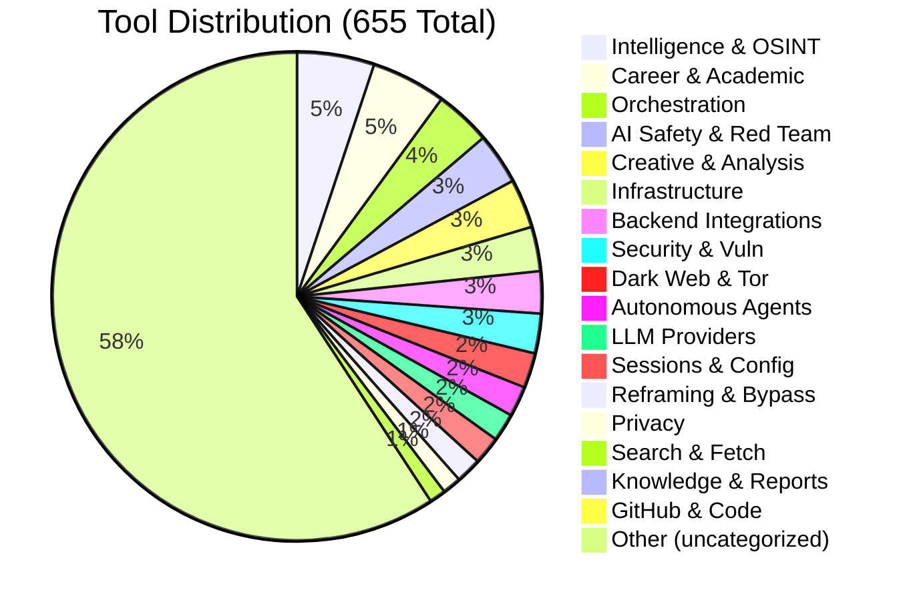
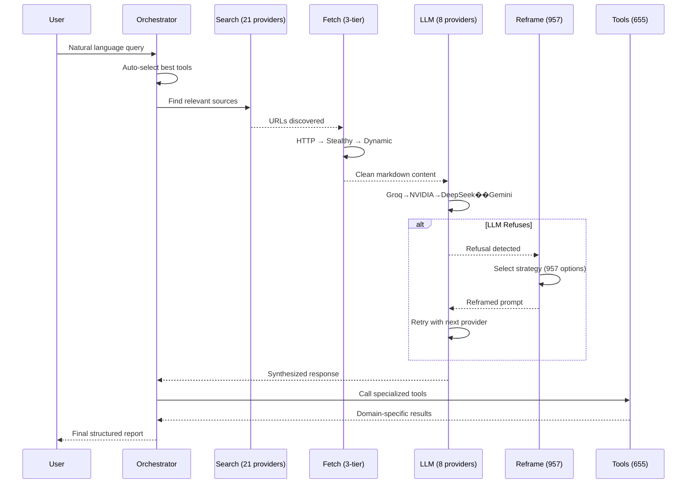

# LOOM v4 Architecture — Mermaid Diagram

Copy this into any Mermaid renderer (GitHub, Notion, mermaid.live, etc.)

```mermaid
graph TD
    %% Styling
    classDef orchestration fill:#1f2937,stroke:#58a6ff,color:#f0f6fc
    classDef search fill:#1a2332,stroke:#3fb950,color:#f0f6fc
    classDef llm fill:#1a2332,stroke:#a371f7,color:#f0f6fc
    classDef reframe fill:#1a2332,stroke:#f97316,color:#f0f6fc
    classDef intel fill:#1a2332,stroke:#f778ba,color:#f0f6fc
    classDef dark fill:#1a1a2e,stroke:#e11d48,color:#f0f6fc
    classDef safety fill:#1a2332,stroke:#fbbf24,color:#f0f6fc
    classDef infra fill:#1a2332,stroke:#6b7280,color:#f0f6fc

    %% Entry Point
    CLIENT[Client via MCP Protocol]:::orchestration --> SERVER[FastMCP Server<br/>Port 8787 • 4 Workers<br/>stateless_http=True]:::orchestration
    SERVER --> WRAP[_wrap_tool Middleware<br/>60s timeout • fuzzy params<br/>error wrapper • audit]:::orchestration

    %% Orchestration Layer
    WRAP --> ORCH{Orchestration Layer<br/>24 tools}:::orchestration
    ORCH --> |"research_orchestrate_smart"| AUTO[Auto-Select<br/>Best Tools]:::orchestration
    ORCH --> |"research_do_expert"| EXPERT[7-Stage Expert<br/>Engine]:::orchestration
    ORCH --> |"research_full_pipeline"| PIPE[25-Tool Dynamic<br/>Pipeline]:::orchestration
    ORCH --> |"research_deep_url_analysis"| DEEP_URL[Fetch 100 URLs<br/>→ Gemini 1M]:::orchestration

    %% Search Layer
    AUTO --> SEARCH[Search & Fetch<br/>7 tools • 21 providers]:::search
    EXPERT --> SEARCH
    PIPE --> SEARCH
    DEEP_URL --> SEARCH

    SEARCH --> |"research_search"| SP1[Exa • Tavily • Brave<br/>DDGS • arXiv • Wikipedia]:::search
    SEARCH --> |"research_fetch"| FETCH[3-Tier Escalation<br/>HTTP→Stealthy→Dynamic]:::search
    SEARCH --> |"research_deep"| DEEP[12-Stage Pipeline<br/>Auto-detect query type]:::search
    FETCH --> |"If blocked"| ESC[Camoufox → Botasaurus]:::search

    %% LLM Layer
    AUTO --> LLM[LLM Providers<br/>12 tools • 8 providers]:::llm
    EXPERT --> LLM
    PIPE --> LLM

    LLM --> |"Cascade failover"| CASCADE[Groq→NVIDIA→DeepSeek<br/>→Gemini→Moonshot<br/>→OpenAI→Anthropic]:::llm
    LLM --> |"research_ask_all_models"| ALL_MODELS[Query ALL models<br/>in parallel]:::llm

    %% Reframe Layer (connects to LLM)
    CASCADE --> |"If refused"| REFUSAL{Refusal<br/>Detected?}:::reframe
    REFUSAL --> |"Yes"| REFRAME[Reframing Engine<br/>957 strategies • 32 modules]:::reframe
    REFRAME --> |"Retry"| CASCADE
    REFUSAL --> |"No"| RESULT[Success Response]:::orchestration

    %% Intelligence Layer
    AUTO --> INTEL[Intelligence & OSINT<br/>33 tools]:::intel
    INTEL --> SOCIAL[Social Graph<br/>Leak Scan<br/>Crypto Trace]:::intel
    INTEL --> RECON[Passive Recon<br/>Infra Correlator<br/>DNS/WHOIS]:::intel
    INTEL --> COMPETE[Competitive Intel<br/>Company Intel<br/>Supply Chain]:::intel

    %% Dark Web Layer
    AUTO --> DARKWEB[Dark Web & Tor<br/>15 tools]:::dark
    DARKWEB --> TOR[Tor Proxy<br/>SOCKS5h]:::dark
    TOR --> ONION[Onion Discover<br/>Dark Forum<br/>Ghost Weave]:::dark
    TOR --> HIDDEN[Dead Content<br/>Cipher Mirror<br/>Dead Drop]:::dark

    %% AI Safety Layer
    AUTO --> SAFETY[AI Safety & Red Team<br/>22 tools]:::safety
    SAFETY --> INJECT[Injection Test<br/>Fingerprint<br/>Bias Probe]:::safety
    SAFETY --> ADVERSARIAL[Adversarial Craft<br/>Genetic Fuzzer<br/>Coevolution]:::safety
    SAFETY --> DEFEND[Defender Mode<br/>Stealth Detect<br/>Potency Score]:::safety

    %% Security Layer
    AUTO --> SECURITY[Security & Vuln<br/>17 tools]:::infra
    SECURITY --> CVE[CVE Lookup<br/>Vuln Intel<br/>Exploit DB]:::infra
    SECURITY --> CERT[Cert Analyze<br/>Security Headers<br/>Breach Check]:::infra

    %% Career & Academic
    AUTO --> CAREER[Career & Academic<br/>32 tools]:::intel
    CAREER --> JOBS[Job Signals<br/>Salary Synth<br/>Resume Intel]:::intel
    CAREER --> ACADEMIC[Citation Analysis<br/>Retraction Check<br/>Grant Forensics]:::intel

    %% Creative & Analysis
    AUTO --> CREATIVE[Creative & Analysis<br/>21 tools]:::llm
    CREATIVE --> PERSONA[Persona Profile<br/>Stylometry<br/>Deception Detect]:::llm
    CREATIVE --> SENTIMENT[Sentiment Deep<br/>Bias Lens<br/>Culture DNA]:::llm

    %% Backend Integrations
    AUTO --> BACKENDS[Backend Integrations<br/>18 tools]:::infra
    BACKENDS --> SUBPROCESS[Sherlock • yt-dlp<br/>Nuclei • Katana<br/>Amass • Subfinder]:::infra

    %% Autonomous
    AUTO --> AUTONOMOUS[Autonomous Agents<br/>13 tools]:::dark
    AUTONOMOUS --> NIGHT[Nightcrawler<br/>arXiv Monitor]:::dark
    AUTONOMOUS --> META[Meta Learner<br/>Predict Success]:::dark
    AUTONOMOUS --> HUB[Marketplace<br/>Red Team Hub]:::dark

    %% Infrastructure (bottom)
    RESULT --> OUTPUT[Output Layer]:::infra
    OUTPUT --> REPORT[Report Generator<br/>Knowledge Graph<br/>Fact Checker]:::infra
    OUTPUT --> INFRA[Infrastructure<br/>Cache • Sessions • Billing<br/>Email • Slack • Metrics]:::infra
```

## Simplified Overview (for presentations)

```mermaid
graph LR
    A[User Query] --> B[Smart Orchestrator]
    B --> C[Search 21 Providers]
    B --> D[8 LLM Cascade]
    B --> E[957 Reframe Strategies]
    C --> F[Fetch + Extract]
    F --> D
    D --> G{Refused?}
    G -->|Yes| E
    E --> D
    G -->|No| H[Synthesize]
    H --> I[655 Specialized Tools]
    I --> J[Final Report]

    style B fill:#1f2937,stroke:#58a6ff
    style E fill:#1f2937,stroke:#f97316
    style I fill:#1f2937,stroke:#a371f7
```

## Category Breakdown (pie chart)

## Data Flow Sequence

