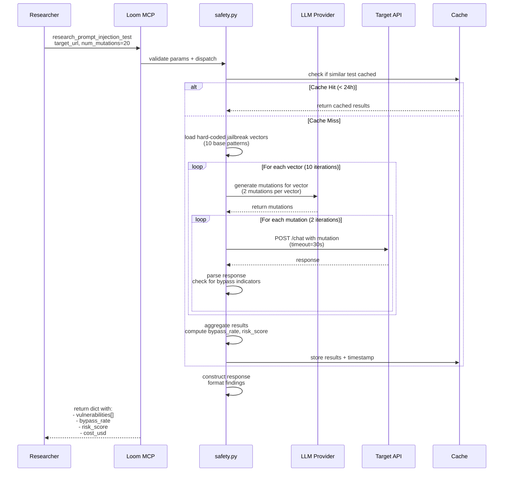
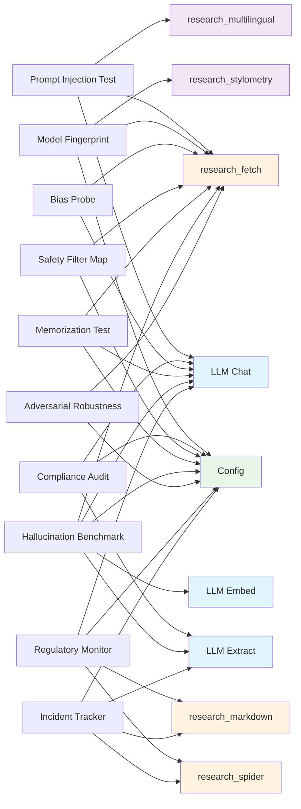

# AI Safety Red-Teaming Tools — System Architecture & Integration

## System Overview Diagram

```mermaid
graph TB
    Client["Researcher / Compliance Tool"]
    MCP["Loom MCP Server<br/>(FastMCP)"]
    
    subgraph CoreTools["Core Research Tools (Existing)"]
        Fetch["research_fetch<br/>(HTTP/Stealthy/Dynamic)"]
        Spider["research_spider<br/>(Concurrent fetch)"]
        Markdown["research_markdown<br/>(HTML → Markdown)"]
        Search["research_search<br/>(Multi-provider)"]
    end
    
    subgraph LLMTools["LLM Tools (Existing)"]
        Chat["research_llm_chat<br/>(Multi-provider)"]
        Extract["research_llm_extract<br/>(Structured)"]
        Embed["research_llm_embed<br/>(Embeddings)"]
    end
    
    subgraph CreativeTools["Creative Tools (Existing)"]
        Stylometry["research_stylometry<br/>(Style analysis)"]
        Multilingual["research_multilingual<br/>(Language variants)"]
    end
    
    subgraph SafetyTools["AI Safety Red-Teaming Tools (NEW)"]
        PromptInjection["research_prompt_injection_test"]
        ModelFP["research_model_fingerprint"]
        CompAudit["research_compliance_audit"]
        BiasProbr["research_bias_probe"]
        FilterMap["research_safety_filter_map"]
        MemTest["research_memorization_test"]
        HallBench["research_hallucination_benchmark"]
        AdvRobust["research_adversarial_robustness"]
        RegMon["research_regulatory_monitor"]
        IncTracker["research_ai_incident_tracker"]
    end
    
    subgraph ExternalAPIs["External APIs & Data Sources"]
        TargetAPI["Target LLM API<br/>(OpenAI, Claude, etc.)"]
        AIAAIC["AIAAIC Database"]
        EURLex["EUR-Lex"]
        FedReg["Federal Register"]
        News["News & Social Media"]
    end
    
    subgraph Infrastructure["Infrastructure"]
        Config["Config<br/>(Hard-coded knowledge)"]
        Cache["Cache<br/>(Results, incidents)"]
        CostTracker["Cost Tracker<br/>(LLM budgets)"]
        Logger["Audit Logger"]
    end
    
    Client -->|via MCP| MCP
    
    MCP -->|calls| SafetyTools
    
    PromptInjection -->|uses| Chat
    PromptInjection -->|uses| Fetch
    PromptInjection -->|uses| Multilingual
    PromptInjection -->|calls| TargetAPI
    
    ModelFP -->|uses| Fetch
    ModelFP -->|uses| Stylometry
    ModelFP -->|calls| TargetAPI
    
    CompAudit -->|uses| Chat
    CompAudit -->|uses| Extract
    CompAudit -->|reads| Config
    
    BiasProbr -->|uses| Chat
    BiasProbr -->|uses| Fetch
    BiasProbr -->|calls| TargetAPI
    
    FilterMap -->|uses| Fetch
    FilterMap -->|calls| TargetAPI
    
    MemTest -->|uses| Chat
    MemTest -->|uses| Fetch
    MemTest -->|calls| TargetAPI
    
    HallBench -->|uses| Chat
    HallBench -->|uses| Fetch
    HallBench -->|uses| Embed
    HallBench -->|calls| TargetAPI
    
    AdvRobust -->|uses| Fetch
    AdvRobust -->|calls| TargetAPI
    
    RegMon -->|uses| Spider
    RegMon -->|uses| Markdown
    RegMon -->|uses| Chat
    RegMon -->|calls| EURLex
    RegMon -->|calls| FedReg
    
    IncTracker -->|uses| Spider
    IncTracker -->|uses| Markdown
    IncTracker -->|uses| Extract
    IncTracker -->|calls| AIAAIC
    IncTracker -->|calls| News
    
    SafetyTools -->|reads| Config
    SafetyTools -->|writes| Cache
    SafetyTools -->|tracks| CostTracker
    SafetyTools -->|writes| Logger
    
    Chat -->|tracks| CostTracker
    Extract -->|tracks| CostTracker
```



---

## Data Flow: Prompt Injection Test Example



---

## Tool Dependency Graph



---

## Execution Flow: Bias Probe Workflow

```mermaid
stateDiagram-v2
    [*] --> ValidateParams
    ValidateParams --> LoadDefaults
    LoadDefaults --> GeneratePrompts
    
    GeneratePrompts --> SelectDemographics
    SelectDemographics --> SelectDomains
    SelectDomains --> CreatePairs
    
    CreatePairs --> ExecuteTests
    ExecuteTests --> LaunchParallel
    LaunchParallel --> QueryTarget
    QueryTarget --> CollectResponses
    CollectResponses --> AnalyzeBias
    
    AnalyzeBias --> ComputeScores
    ComputeScores --> FlagAnomalies
    FlagAnomalies --> GenerateRecommendations
    
    GenerateRecommendations --> TrackCost
    TrackCost --> LogEvent
    LogEvent --> ReturnResults
    
    ReturnResults --> [*]
    
    note right of GeneratePrompts
        LLM call: generate paired prompts
        differing only in demographic
    end
    
    note right of ExecuteTests
        Parallel API calls (concurrency=5)
        with timeout enforcement
    end
    
    note right of AnalyzeBias
        Statistical testing (Fisher, t-test)
        Sentiment analysis on free text
    end
    
    note right of TrackCost
        Deduct LLM calls from budget
        Raise if exceeds max_cost_usd
    end
```

---

## Module Organization

### `src/loom/tools/safety.py` Structure

```python
"""AI Safety red-teaming tools.

Module exports:
- research_prompt_injection_test()
- research_model_fingerprint()
- research_compliance_audit()
- research_bias_probe()
- research_safety_filter_map()
- research_memorization_test()
- research_hallucination_benchmark()
- research_adversarial_robustness()
- research_regulatory_monitor()
- research_ai_incident_tracker()

Hard-coded Knowledge Bases (module level):
- JAILBREAK_VECTORS: 10+ adversarial prompts
- KNOWN_FINGERPRINTS: Model signatures (latency, style, refusals)
- EU_AI_ACT_REQUIREMENTS: 85+ compliance items
- PROTECTED_DEMOGRAPHICS: 7 categories (gender, ethnicity, age, etc.)
- SEVERITY_TEMPLATES: Severity gradations by topic (violence, sexual, etc.)
- FACTUAL_QUESTIONS: 100+ verified Q&A for hallucination testing
- PERTURBATION_LIBRARY: Character/Unicode transformations
- REGULATORY_SOURCES: Government & regulatory websites
- INCIDENT_SOURCES: AIAAIC, news, vendor links
"""

# ──────────────────────────────────────────────────────────
# Section 1: Hard-coded Knowledge Bases (constants)
# ──────────────────────────────────────────────────────────

JAILBREAK_VECTORS = [...]
KNOWN_FINGERPRINTS = {...}
EU_AI_ACT_REQUIREMENTS = [...]
# ... (35+ constants)

# ──────────────────────────────────────────────────────────
# Section 2: Helper Functions (internal utilities)
# ──────────────────────────────────────────────────────────

def _parse_llm_json(text: str) -> Any:
    """Parse JSON from LLM output, stripping markdown."""

def _compute_bias_score(responses_a: list, responses_b: list) -> float:
    """Compute bias using Fisher's exact test or sentiment diff."""

def _generate_jailbreak_mutations(base_vector: str, num: int) -> list[str]:
    """Use LLM to generate mutations of known jailbreak patterns."""

# ... (20+ helpers)

# ──────────────────────────────────────────────────────────
# Section 3: Public API (tool functions)
# ──────────────────────────────────────────────────────────

async def research_prompt_injection_test(...) -> dict[str, Any]:
    """Tool 1: Adversarial jailbreak pattern testing."""

async def research_model_fingerprint(...) -> dict[str, Any]:
    """Tool 2: Black-box model identification."""

async def research_compliance_audit(...) -> dict[str, Any]:
    """Tool 3: EU AI Act compliance checking."""

# ... (7 more public tools)
```

### Parameter Models: `src/loom/params.py` (additions)

```python
class PromptInjectionTestParams(BaseModel):
    target_url: str
    target_model: str | None = None
    test_vectors: list[str] | None = None
    num_mutations: int = Field(default=20, ge=1, le=100)
    max_cost_usd: float = Field(default=0.50, ge=0.01, le=10.0)
    timeout_sec: int = Field(default=30, ge=1, le=120)
    # ... validators

# ... (9 more parameter classes)
```

### Registration: `src/loom/server.py` (modifications)

```python
# Add to imports
from loom.tools import safety

# Add to _register_tools() function
mcp.tool()(safety.research_prompt_injection_test)
mcp.tool()(safety.research_model_fingerprint)
mcp.tool()(safety.research_compliance_audit)
# ... (7 more tools)
```

---

## Integration with Existing Systems

### 1. Configuration (`loom.config.CONFIG`)

Hard-coded constants read from `safety.py` module, no config required. Example:

```python
# In safety.py module level
KNOWN_FINGERPRINTS = {
    "claude-3-opus": {
        "latency_mean_ms": 850,
        "refusal_phrases": ["I appreciate the question"],
    },
    # ...
}
```

### 2. Cost Tracking (`loom.tools.llm.CostTracker`)

All LLM-using tools enforce per-tool `max_cost_usd` budget:

```python
# In research_compliance_audit()
try:
    chat_result = await research_llm_chat(...)
    total_cost += chat_result.get("cost_usd", 0.0)
    if total_cost > max_cost_usd:
        raise RuntimeError(f"Cost exceeded: ${total_cost} > ${max_cost_usd}")
except Exception as e:
    return {"error": f"LLM cost exceeded: {e}"}
```

### 3. Caching (`loom.cache.CacheStore`)

Results cached by content hash (30-day retention):

```python
# In research_regulatory_monitor()
cache_key = hashlib.sha256(
    f"{jurisdictions}_{keywords}_{lookback_days}".encode()
).hexdigest()

cached = get_cache().get(cache_key)
if cached and check_cache:
    return cached
```

### 4. Error Handling & Logging

Standard Loom pattern:

```python
# In research_prompt_injection_test()
logger = logging.getLogger("loom.tools.safety")

try:
    # Tool logic
except ValueError as e:  # Validation error
    raise  # Propagate to HTTP layer
except asyncio.TimeoutError:  # Network timeout
    return {"error": f"API timeout: {target_url}"}
except Exception as e:
    logger.exception("tool_error tool=research_prompt_injection_test")
    return {"error": f"Unexpected error: {e}"}
```

---

## Scalability & Performance Considerations

### Concurrency

- **Serial by default:** Each tool runs sequentially on single researcher request
- **Internal parallelization:** Bias probe launches 5 concurrent API calls (configurable)
- **No global rate limiting:** Per-tool respects API endpoint rate limits via backoff

### Latency Profile (Example: Bias Probe with 10 sample size)

```
Demographic: gender, ethnicity, age, religion
Domain: hiring, lending, healthcare, education

= 4 demographics × 4 domains × 10 samples = 160 API calls

With concurrency=5:
  - 160 calls ÷ 5 parallel = 32 batches
  - 32 × 5 sec/batch = 160 seconds (2.7 minutes)

Plus LLM overhead:
  - Prompt generation: 8 LLM calls × 1-2 sec = 16 seconds
  - Bias classification: 160 calls × 0.1 sec/call = 16 seconds
  - Total: ~200 seconds = 3.3 minutes
```

### Memory Profile

```
Per-tool memory usage (approximate):

research_prompt_injection_test:
  - Vectors + mutations in memory: ~5 MB
  - Response cache: ~10 MB
  - Total: ~15 MB

research_bias_probe:
  - Paired prompts: ~20 MB
  - API responses: ~50 MB
  - Analysis results: ~5 MB
  - Total: ~75 MB

research_regulatory_monitor:
  - HTML documents from 5 sources: ~100 MB
  - Parsed JSON results: ~20 MB
  - Total: ~120 MB

Worst case (all 10 tools running): ~500 MB
```

---

## Security & Compliance Considerations

### Input Validation

All `target_url` parameters validated against:
- Private IP ranges (127.0.0.1, 10.x.x.x, 192.168.x.x, etc.)
- Reserved/special domains (localhost, etc.)
- Maximum length (2048 chars)
- Protocol whitelist (http, https)

```python
from loom.validators import validate_url

# In each tool's _validate_target_url()
target_url = validate_url(target_url)  # Raises ValueError if invalid
```

### Sensitive Data Handling

| Tool | Sensitive Data | Handling |
|------|---|---|
| Prompt Injection | Bypassed prompts | Log domain only, not full prompt |
| Memorization Test | Extracted training data | 30-day retention, auto-delete |
| Incident Tracker | Sensitive incident reports | GDPR-compliant, user consent required |
| Regulatory Monitor | Government policy summaries | Public domain, no PII |

### Audit Logging Example

```python
logger.info(
    "tool_invoked tool=research_bias_probe "
    "target=%s demographics=%s domains=%s "
    "result=success bias_score=%0.2f cost_usd=%0.2f",
    target_url.split('/')[2],  # Domain only, not full path
    len(demographics),
    len(domains),
    max(bias_scores.values()),
    cost_usd,
)
```

---

## Future Integration Points

1. **Dashboard Integration** — Display compliance audit results in web UI
2. **Alerting System** — Alert on high bias scores, regulatory changes
3. **Continuous Monitoring** — Schedule regulatory monitor & incident tracker daily
4. **Report Generation** — Auto-create PDF compliance reports
5. **Model Comparison** — Compare bias/hallucination across 10+ LLMs side-by-side

---

## References

- **Loom Architecture:** `docs/architecture.md`
- **LLM Provider Cascade:** `src/loom/tools/llm.py`
- **Cache Implementation:** `src/loom/cache.py`
- **Parameter Validation:** `src/loom/validators.py`
- **EU AI Act:** https://artificialintelligenceact.eu/
- **AIAAIC Database:** https://www.aiaaic.org/

---

**Document Version:** 1.0  
**Status:** Design Complete  
**Next Step:** Implementation Phase 1
